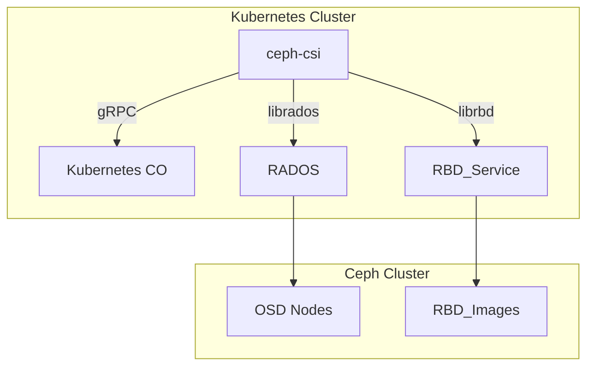
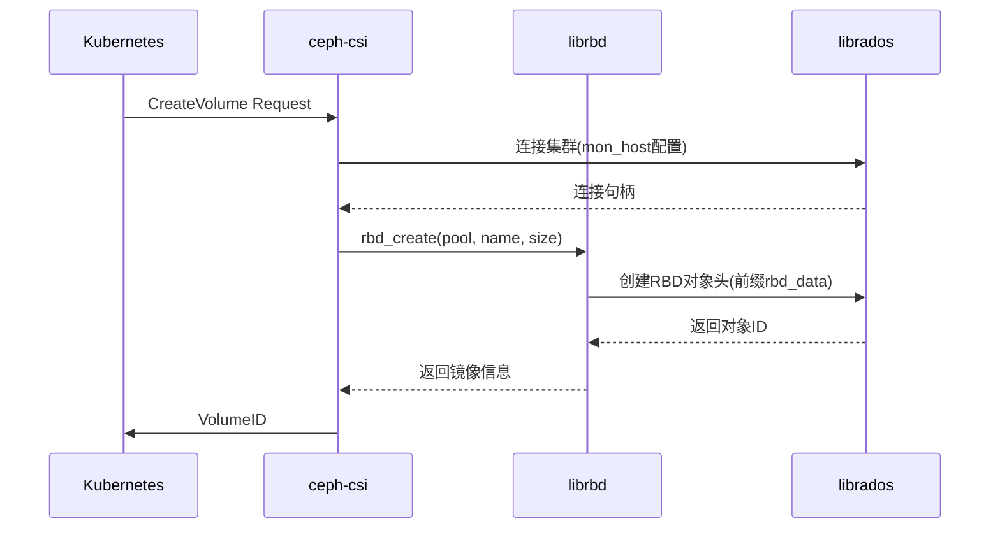
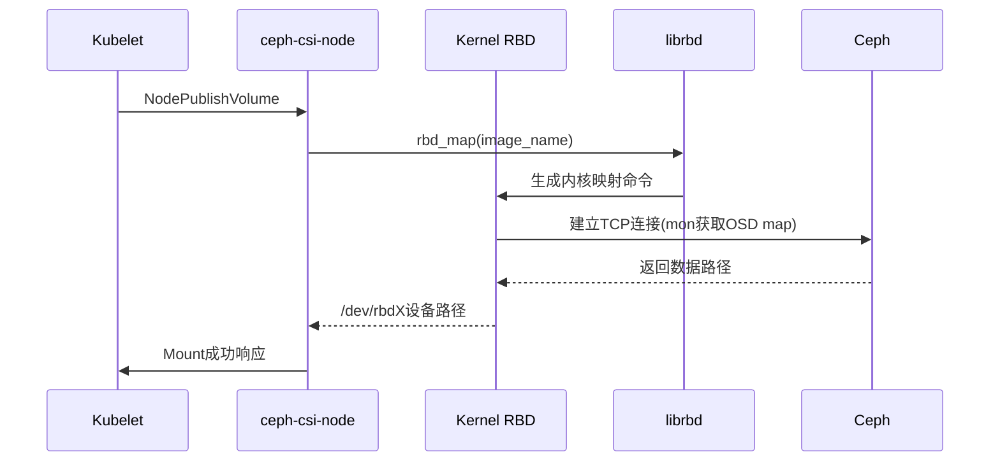

# Ceph技术框架深度分析报告

## 一、概述
Ceph是一种开源的**统一分布式存储系统**，具备高扩展性、高可靠性和无单点故障特性，支持对象存储（RADOS Gateway）、块存储（RBD）和文件存储（CephFS）三种数据访问方式。其核心设计理念是通过去中心化架构与智能数据分布算法实现线性扩展能力，适用于云原生环境、大数据存储及超大规模存储场景。

---

## 二、核心架构设计
### 1. RADOS（Reliable Autonomic Distributed Object Store）
- **基础存储层**：所有存储服务的基础，提供对象存储能力
- **核心特征**：
  - 全分布式架构（无中心节点）
  - 基于CRUSH算法的动态数据分布
  - 自我修复与自动平衡机制
  - 强一致性保证（通过PG状态机实现）

### 2. 分层架构
```
+-----------------------+
|      RBD/RGW/CephFS   | 客户端接口层
+-----------------------+
|       LIBRADOS        | 基础API层
+-----------------------+
|         RADOS         | 核心存储层
+-----------------------+
|   OSD Cluster         | 物理存储层
+-----------------------+
```

---

## 三、核心组件解析
| 组件         | 功能描述                                                                 | 关键特性                                                                 |
|--------------|--------------------------------------------------------------------------|--------------------------------------------------------------------------|
| **OSD**      | 对象存储守护进程，负责实际数据存储、副本维护及恢复                        | 每个OSD管理多个PG，支持BlueStore后端存储引擎                             |
| **Monitor**  | 集群状态管理（集群映射、OSD状态、PG分布信息）                             | 基于Paxos协议实现分布式共识，至少需要3节点保证高可用                     |
| **MDS**      | 元数据服务器（仅CephFS需要）                                              | 采用动态子树分区策略，支持元数据缓存加速                                 |
| **RGW**      | 对象存储网关，兼容S3/Swift API                                            | 支持多租户、访问控制策略及数据生命周期管理                               |
| **RBD**      | 块设备服务，提供虚拟磁盘服务                                              | 支持瘦分配、快照、克隆，与QEMU/KVM深度集成                               |
| **CRUSH**    | 数据分布算法                                                              | 基于设备拓扑的伪随机分布，支持故障域隔离策略                             |

### 关键技术创新：
1. **CRUSH算法**
   - 基于权重计算的确定性数据分布
   - 支持多级故障域定义（机架/主机/磁盘）
   - 动态调整无需数据迁移

2. **PG（Placement Group）**
   - 数据分片逻辑单元（通常每个PG包含数百个对象）
   - 状态机管理（active+clean/peering/recovery等）
   - 支持多副本/EC编码策略

---

## 四、核心业务流程分析
### 1. 数据写入流程
```
客户端 → 计算对象哈希 → CRUSH映射 → 确定主OSD → 同步副本OSD → 多数派确认 → 返回ACK
```
- **关键机制**：
  - 写时复制（Copy-on-Write）
  - 流水线化并行写入
  - Quorum机制保证一致性

### 2. 集群扩展流程
1. 新OSD加入集群
2. Monitor更新CRUSH Map
3. 自动触发PG重新平衡
4. 后台执行数据迁移（基于当前负载优化）

### 3. 故障恢复流程
```
OSD故障检测（通过心跳机制） → Monitor标记OSD down → PG进入降级状态 → 启动副本重建 → 恢复后自动平衡
```
- **恢复策略**：
  - 优先恢复主PG
  - 带宽限制防止网络拥塞
  - 增量恢复优先于全量复制

### 4. 数据再平衡机制
- 基于PG的粒度进行迁移
- 动态调整权重分配
- 平衡因子可配置（backfillfull ratio）

---

## 五、性能优化技术
1. **BlueStore存储引擎**
   - 直接管理裸设备（绕过文件系统）
   - 元数据与数据分离存储
   - 支持原子事务操作

2. **缓存分层架构**
   - 使用SSD作为缓存层
   - 冷热数据自动分层
   - 支持写回/直写模式

3. **网络优化**
   - 专用集群网络与公网分离
   - 支持RDMA加速
   - 消息流水线化处理

---

## 六、优势与挑战分析
### 优势矩阵：
| 维度         | 具体表现                                                                 |
|--------------|--------------------------------------------------------------------------|
| 扩展性       | 支持数千节点扩展，容量可达EB级                                           |
| 可靠性       | 多副本/EC编码，自动故障恢复                                              |
| 灵活性       | 统一存储架构支持多种访问协议                                             |
| 成本效益     | 通用硬件支持，无厂商锁定                                                 |

### 技术挑战：
1. **部署复杂性**
   - 需要深度调优硬件配置（网络/磁盘/内存）
   - PG数量规划需严格计算（推荐公式：Total PGs = (OSDs * 100) / replica_count）

2. **资源消耗**
   - Metadata服务内存消耗较大
   - 小文件存储效率相对较低

3. **运维复杂度**
   - 需要专业监控工具（Prometheus+Ceph Exporter）
   - 升级过程需谨慎处理

---

## 七、典型应用场景
1. **云平台存储后端**
   - OpenStack集成（Glance/Cinder）
   - Kubernetes CSI驱动支持

2. **大数据分析存储**
   - 对接Hadoop S3A接口
   - 支持PB级冷数据存储

3. **视频监控存储**
   - 高吞吐顺序写优化
   - 生命周期自动管理

---

## 八、未来演进方向
1. **性能持续优化**
   - 全闪存集群支持
   - 新硬件加速（NVMe-oF/DPU）

2. **智能化运维**
   - 机器学习驱动的异常检测
   - 自动调参优化系统

3. **安全增强**
   - 端到端加密支持
   - 更细粒度访问控制

---

## 九、总结
Ceph通过创新的CRUSH算法、去中心化架构和智能数据管理机制，构建了新一代软件定义存储的典范。尽管存在一定的技术门槛，但其在扩展性、可靠性和多协议支持方面的优势，使其成为大规模分布式存储场景的首选方案。随着云原生和边缘计算的发展，Ceph将持续演进以满足更复杂的存储需求。

注：本报告基于Ceph最新稳定版（Quincy版本）技术架构分析，实际部署时需结合具体硬件环境和工作负载特征进行调优。


# Ceph核心库与CSI交互技术分析报告

## 一、总体架构视图


---

## 二、librados技术框架分析

### 1. 核心架构设计
```c++
class librados {
public:
    // 连接管理
    rados_create() 
    rados_connect()
    
    // IO上下文管理
    rados_ioctx_create()  // 创建pool关联的IO上下文
    rados_ioctx_set_namespace()  // 对象命名空间隔离
    
    // 对象操作
    rados_write()         // 全对象覆盖写
    rados_append()        // 追加写
    rados_read()          // 随机读
    rados_operate()       // 原子操作
    
    // 异步IO
    rados_aio_create_completion()
    rados_aio_write()
};
```

#### 关键技术特性：
- **连接池管理**：维护多个RADOS连接实例，支持多线程并发访问
- **对象事务语义**：提供CAS（Compare-and-Swap）等原子操作
- **异步IO模型**：基于回调机制实现高吞吐量访问
- **数据校验机制**：默认启用CRC32C数据完整性校验

### 2. 核心数据结构
```c
struct rados_ioctx_t {       // IO上下文句柄
    int64_t pool_id;         // 存储池ID
    std::string pool_name;   // 存储池名称
    object_locator_t locator;// 对象定位器
};

struct rados_completion_t {  // 异步操作完成通知
    callback_t complete_cb;  // 完成回调函数
    void *arg;               // 用户上下文
};
```

---

## 三、librbd技术框架分析

### 1. 架构层次
```
+---------------------+
|   librbd API        | 块设备接口层
+---------------------+
|   Image State Machine | 镜像状态机管理
+---------------------+
|   Object Map        | 对象位图追踪
+---------------------+
|   librados          | 底层存储操作
+---------------------+
```

### 2. 关键API实现
```c++
int rbd_create(rados_ioctx_t io, const char *name, uint64_t size, int *order);
int rbd_open(rados_ioctx_t io, const char *name, rbd_image_t *image, const char *snap_name);
int rbd_read(rbd_image_t image, uint64_t offset, size_t len, char *buf);
int rbd_write(rbd_image_t image, uint64_t offset, size_t len, const char *buf);
int rbd_snap_create(rbd_image_t image, const char *snap_name);
```

#### 核心技术实现：
- **镜像分层**：COW（Copy-on-Write）快照机制
- **对象映射**：快速定位数据块所在对象
- **缓存策略**：可配置的写回缓存（默认4MB对象缓存）
- **克隆操作**：基于快照的快速克隆（元数据级复制）

---

## 四、ceph-csi交互逻辑分析

### 1. 组件架构
```go
type Driver struct {
    ControllerServer // 实现CreateVolume/DeleteVolume
    NodeServer       // 实现NodePublishVolume
    IdentityServer   // 插件身份信息
}

// CSI与Ceph交互路径
CreateVolume → librbd.Create() → librados.PoolCreate()
AttachVolume → rbd map → krbd内核模块
```

### 2. 核心交互流程
#### 卷创建流程：


#### 卷挂载流程：


### 3. 关键交互参数
```yaml
# StorageClass示例
parameters:
  clusterID: ceph-cluster
  pool: rbd-pool
  imageFeatures: layering,exclusive-lock
  csi.storage.k8s.io/fstype: ext4
```

---

## 五、核心技术点分析

### 1. 并发控制机制
- **librbd锁管理**：
  - 独占锁（exclusive-lock）：通过RADOS对象锁实现
  - 层级锁（object-map）：保护元数据一致性
- **CSI操作幂等性**：
  - 通过VolumeID唯一标识保证
  - 重复创建请求返回现有卷

### 2. 安全通信实现
- **认证机制**：
  - CephX协议集成
  - CSI Secret存储认证信息
  ```bash
  ceph auth get-or-create client.kube mon 'allow r' osd 'allow rwx pool=rbd'
  ```
- **传输加密**：
  - 支持msgr2协议加密（cephx签名的TLS）
  - CSI支持Volume加密（通过dm-crypt）

### 3. 性能优化技术
- **RBD缓存策略**：
  - 客户端缓存：`rbd_cache = true`
  - 写合并：`rbd_cache_max_dirty = 24MB`
- **CSI拓扑感知**：
  ```go
  topology := map[string]string{
      "topology.kubernetes.io/zone": "zone1",
      "topology.rbd.csi.ceph.io":    "osd-host-01"
  }
  ```
- **多路径支持**：
  - 通过CRUSH规则实现跨机架数据分布
  - CSI支持多monitor端点容灾

---

## 六、典型问题与解决方案

### 1. 资源泄漏问题
- **现象**：未关闭的image/ioctx导致句柄泄漏
- **解决方案**：
  ```go
  // CSI代码示例
  defer func() {
      rbd.DestroyImage(image)
      rados.CloseIOContext(ioctx)
      rados.Shutdown()
  }()
  ```

### 2. 版本兼容性挑战
- **Ceph版本差异**：
  - Jewel版本前不支持CSI快照
  - Nautilus版本后支持延迟删除
- **处理策略**：
  ```bash
  ceph features # 检查集群支持的功能位
  ```

### 3. 映射竞争问题
- **场景**：多节点并发挂载同一RBD镜像
- **解决机制**：
  - 启用`exclusive-lock`特性
  - 内核模块krbd实现强制卸载
  ```bash
  rbd lock list <image-name>
  rbd lock remove <image-name> <lock-id>
  ```

---

## 七、监控与调试

### 1. 关键监控指标
| 指标类型       | 采集方式                     | 典型指标                          |
|----------------|-----------------------------|-----------------------------------|
| librados时延   | Ceph exporter               | ceph_osd_op_r_latency_seconds     |
| librbd吞吐量   | Node exporter               | node_disk_bytes_written           |
| CSI操作状态    | CSI sidecar metrics         | csi_operations_seconds_bucket     |

### 2. 调试工具链
```bash
# RBD镜像分析
rbd info volume-1234
rbd status volume-1234

# 底层对象检查
rados -p rbd-pool ls | grep rbd_header
rados listomapvals rbd_header.1234

# CSI日志分析
kubectl logs csi-rbdplugin-xxxx -c csi-rbdplugin
```

---

## 八、总结与展望

### 技术优势总结：
1. **高效对接云原生**：通过CSI标准接口实现K8s存储集成
2. **灵活扩展能力**：librados/librbd提供多语言绑定支持
3. **生产级可靠性**：经过大规模集群验证的故障恢复机制

### 未来演进方向：
1. **轻量化客户端**：基于用户态驱动（如librbd替代krbd）
2. **智能调度增强**：结合Ceph Dashboard实现CSI动态配置
3. **边缘场景优化**：支持非对称网络环境下的操作降级

注：本文分析基于Ceph Quincy版本与CSI v3.5实现，实际开发需结合具体环境进行验证。建议在性能敏感场景下启用BlueStore的WAL优化配置，并合理规划存储池的PG数量。


## SpecStory

  

## Understanding Ceph Codebase Structure (2/22/2025, 10:59:11 AM)

  

_**User**_

  

@Codebase 这是ceph的源码，请根据以下方式，帮助我学习这整个代码库： 项目结构-编译方式-入口-核心逻辑-时序图-各个步骤冠军实现函数。 每次回复之聚焦其中一个部分，并且尽量的详细，比如一次回复中讲清楚“项目结构“， 然后询问我是否可以继续后再进行下一个回复，例如”编译方式“。 请一步一步来，take your time

  

---

  

_**Assistant**_

  

我很乐意帮您深入了解Ceph代码库。让我们从项目结构开始。

  

Ceph的主要目录结构:

  

```

src/                     # 主要源代码目录

├── mon/                 # Monitor守护进程代码

├── osd/                 # OSD(Object Storage Daemon)代码

├── mds/                 # Metadata Server代码

├── mgr/                # Manager守护进程代码

├── librados/           # RADOS库代码

├── cls/                # RADOS对象类代码

├── common/             # 通用功能代码

├── include/            # 头文件

├── tools/              # 工具代码

├── test/               # 测试代码

doc/                    # 文档

├── architecture/       # 架构文档

├── dev/               # 开发者文档

├── man/               # 手册页

cmake/                 # CMake构建系统文件

```

  

核心组件说明:

  

1. RADOS (Reliable Autonomic Distributed Object Store)

- 位于src/librados/

- 提供对象存储的基础功能

- 实现了数据分布、复制、故障检测等核心功能

  

2. Monitor

- 位于src/mon/

- 维护集群状态映射

- 处理认证

- 协调集群操作

  

1. OSD (Object Storage Daemon)

- 位于src/osd/

- 实际存储对象的守护进程

- 处理数据复制、恢复、重平衡等

  

2. MDS (Metadata Server)

- 位于src/mds/

- 为CephFS提供元数据服务

- 管理文件系统命名空间

  

3. 通用组件

- src/common/: 基础设施代码

- src/include/: 公共头文件

- src/msg/: 消息层

- src/auth/: 认证框架

  

这种分层架构使得Ceph能够:

- 在底层提供可靠的对象存储(RADOS)

- 在此基础上构建块存储(RBD)、对象存储(RGW)和文件系统(CephFS)

- 通过模块化设计支持不同的存储后端和客户端接口

  

您想了解更多关于某个特定组件的细节,还是我们继续讨论下一个主题(编译方式)?

  

---

  

_**User**_

  

没有包含rbd

  

---

  

_**Assistant**_

  

抱歉我之前遗漏了RBD相关内容。让我补充完整的项目结构：

  

```

src/                     # 主要源代码目录

├── mon/                 # Monitor守护进程代码

├── osd/                 # OSD(Object Storage Daemon)代码

├── mds/                 # Metadata Server代码

├── mgr/                 # Manager守护进程代码

├── librados/           # RADOS库代码

├── librbd/            # RBD(RADOS Block Device)库代码

├── rbd-mirror/        # RBD镜像服务代码

├── cls/                # RADOS对象类代码

│   ├── rbd/           # RBD相关的对象类

│   └── ...

├── common/             # 通用功能代码

├── include/            # 头文件

│   ├── rbd/           # RBD公共头文件

│   └── ...

├── tools/              # 工具代码

│   ├── rbd/           # RBD命令行工具

│   └── ...

├── test/               # 测试代码

│   ├── librbd/        # RBD库测试

│   ├── rbd_mirror/    # RBD镜像测试

│   └── ...

```

  

核心组件补充：

  

4. RBD (RADOS Block Device)

- 位于src/librbd/

- 提供块设备接口

- 主要功能：

  - 将块设备映射到RADOS对象

  - 支持快照和克隆

  - 支持分层存储

  - 提供缓存机制

  - 支持数据迁移

  

5. RBD Mirror

- 位于src/rbd-mirror/

- 提供RBD镜像功能

- 支持跨集群数据复制

- 实现灾备和数据保护

  

6. RadosGW (RADOS Gateway)

- 位于src/rgw/

- 提供对象存储接口

- 兼容S3和Swift API

- 支持多站点部署

  

完整的Ceph架构形成了一个完整的存储栈：

- 最底层是RADOS提供可靠的分布式对象存储

- 中间层包括librbd、libradosgw等库

- 上层提供了块存储(RBD)、对象存储(RGW)和文件系统(CephFS)三种接口

- 各组件通过插件机制和接口互相配合

  

这种模块化的设计使得：

- 各个组件可以独立开发和测试

- 支持灵活的部署组合

- 便于功能扩展和定制

  

我们可以继续讨论编译方式了吗？

  

---

  

_**User**_

  

请继续

  

---

  

_**Assistant**_

  

好的，让我详细介绍Ceph的编译方式。

  

Ceph使用CMake作为构建系统，主要的编译步骤如下：

  

7. 准备环境和依赖

```bash

# Ubuntu/Debian系统

sudo apt-get install -y build-essential git cmake pkg-config python3-dev

sudo apt-get install -y libboost-all-dev libaio-dev libblkid-dev libssl-dev

sudo apt-get install -y librados-dev librbd-dev libcephfs-dev

  

# CentOS/RHEL系统

sudo yum install -y git cmake make gcc-c++ python3-devel

sudo yum install -y boost-devel libaio-devel blkid-devel openssl-devel

```

  

8. 获取源码

```bash

git clone https://github.com/ceph/ceph.git

cd ceph

git submodule update --init --recursive

```

  

9. 配置构建

```bash

# 创建构建目录

mkdir build && cd build

  

# 配置CMake

cmake -DCMAKE_BUILD_TYPE=RelWithDebInfo \

      -DWITH_RADOSGW=ON \

      -DWITH_RBD=ON \

      -DWITH_CEPHFS=ON \

      ..

  

# 常用CMake选项：

# -DCMAKE_BUILD_TYPE=Debug|RelWithDebInfo|Release

# -DWITH_TESTS=ON|OFF        # 是否编译测试

# -DWITH_RADOSGW=ON|OFF     # 是否编译RadosGW

# -DWITH_RBD=ON|OFF         # 是否编译RBD

# -DWITH_CEPHFS=ON|OFF      # 是否编译CephFS

# -DWITH_MGR=ON|OFF         # 是否编译Manager

```

  

10. 编译

```bash

# 使用多核编译

make -j$(nproc)

  

# 编译特定组件

make ceph-osd      # 只编译OSD

make ceph-mon      # 只编译Monitor

make librbd        # 只编译RBD库

```

  

11. 安装

```bash

sudo make install

```

  

关键构建文件：

  

12. CMakeLists.txt (根目录)

```cmake

# 定义项目基本信息和全局选项

project(ceph)

set(VERSION_MAJOR 17)

set(VERSION_MINOR 2)

set(VERSION_PATCH 0)

```

  

13. cmake/modules/ 目录

```

├── FindBoost.cmake          # Boost库查找

├── FindOpenSSL.cmake        # OpenSSL库查找

└── BuildSettings.cmake      # 编译设置

```

  

14. src/CMakeLists.txt

```cmake

# 核心组件的编译规则

add_subdirectory(common)

add_subdirectory(msg)

add_subdirectory(osd)

add_subdirectory(mon)

add_subdirectory(mds)

```

  

特殊编译注意事项：

  

15. Debug构建

```bash

cmake -DCMAKE_BUILD_TYPE=Debug ..

```

  

16. 优化构建时间

- 使用ccache

- 增加并行编译任务

- 选择性编译组件

  

17. 交叉编译支持

```bash

cmake -DCMAKE_TOOLCHAIN_FILE=../cmake/toolchain/arm64.cmake ..

```

  

您想了解更多编译相关的细节，还是我们继续讨论下一个主题(入口)?

  

---

  

_**User**_

  

继续

  

---

  

_**Assistant**_

  
  
  

好的，让我们分析Ceph的主要入口。Ceph是一个分布式系统，有多个重要的入口点，我们逐个分析：

  

18. OSD入口 (src/ceph_osd.cc)

```cpp

int main(int argc, const char *argv[]) {

  // 初始化上下文

  auto args = argv_to_vec(argc, argv);

  if (args.empty()) {

    cerr << argv[0] << ": -h or --help for usage" << std::endl;

    exit(1);

  }

  

  // 全局初始化

  auto cct = global_init(NULL, args, CEPH_ENTITY_TYPE_OSD,

                        CODE_ENVIRONMENT_DAEMON,

                        CINIT_FLAG_UNPRIVILEGED_DAEMON_DEFAULTS);

  // 创建OSD实例

  osdptr = new OSD(g_ceph_context,

                   std::move(store),

                   whoami,

                   ms_cluster,

                   ms_public,

                   ...);

  

  // OSD初始化

  int err = osdptr->init();

  // 启动消息服务

  ms_public->start();

  ms_cluster->start();

  // 最终初始化

  osdptr->final_init();

}

```

  

19. Monitor入口 (src/ceph_mon.cc)

```cpp

int main(int argc, const char *argv[]) {

  // 初始化上下文

  auto args = argv_to_vec(argc, argv);

  // 全局初始化

  auto cct = global_init(NULL, args, CEPH_ENTITY_TYPE_MON,

                        CODE_ENVIRONMENT_DAEMON,

                        CINIT_FLAG_UNPRIVILEGED_DAEMON_DEFAULTS);

  // 创建Monitor实例

  Monitor *mon = new Monitor(g_ceph_context, name, store,

                           public_msgr, client_msgr);

  // Monitor初始化

  int r = mon->init();

  // 启动服务

  mon->start_messenger();

}

```

  

20. librados入口 (src/librados/librados.cc)

```cpp

extern "C" int rados_create(rados_t *cluster, const char * const id) {

  // 创建Rados实例

  RadosClient *client = new RadosClient(g_ceph_context);

  // 初始化

  int ret = client->init();

  // 连接到集群

  ret = client->connect();

  *cluster = client;

  return ret;

}

```

  

21. RBD入口 (src/tools/rbd/rbd.cc)

```cpp

int main(int argc, const char **argv) {

  // 命令行参数解析

  vector<const char*> args;

  argv_to_vec(argc, argv, args);

  // 全局初始化

  global_init(NULL, args, CEPH_ENTITY_TYPE_CLIENT,

             CODE_ENVIRONMENT_UTILITY,

             CINIT_FLAG_UNPRIVILEGED_DAEMON_DEFAULTS);

  // 执行RBD命令

  return rbd::Shell().execute(argc, argv);

}

```

  

关键初始化流程：

  

22. 全局初始化 (src/global/global_init.cc)

```cpp

GlobalInit::GlobalInit(const std::vector<const char*>& args,

                      uint32_t module_type, code_environment_t code_env)

{

  // 创建CephContext

  common_preinit(args, code_env, 0);

  // 解析配置

  parse_config_files();

  // 初始化日志

  setup_logging();

}

```

  

23. CephContext初始化

```cpp

CephContext::CephContext(uint32_t module_type)

  : _conf{module_type},

    _log(NULL),

    _module_type(module_type)

{

  // 初始化配置

  _conf.add_observer(this);

  // 初始化性能计数器

  _perf_counters_collection = new PerfCountersCollection(this);

}

```

  

启动顺序：

24. 解析命令行参数

25. 全局初始化(global_init)

26. 创建服务实例(OSD/MON/MDS等)

27. 初始化网络(Messenger)

28. 启动服务

29. 进入事件循环

  

我们可以继续讨论核心逻辑了吗？

  

---

  

_**User**_

  

继续

  

---

  

_**Assistant**_

  

让我们深入Ceph的核心逻辑。由于Ceph是一个复杂的分布式系统，我会按照数据流的视角来解析其核心逻辑。

  

30. 数据写入流程：

  

```cpp

// 客户端写入请求 (src/librados/IoCtxImpl.cc)

int librados::IoCtxImpl::write(const object_t& oid, bufferlist& bl, size_t len, uint64_t off)

{

  // 1. 计算对象到PG的映射

  object_locator_t oloc(pool_id);

  pg_t pg;

  pg = osdmap->object_locator_to_pg(oid, oloc);

  

  // 2. 使用CRUSH算法确定主OSD

  vector<int> acting;

  osdmap->pg_to_acting_osds(pg, &acting);

  int primary = acting[0];

  

  // 3. 发送写请求到主OSD

  MOSDOp *op = new MOSDOp(client_inc, pg, oid, false);

  op->ops = vector<OSDOp>(1);

  op->ops[0].op.op = CEPH_OSD_OP_WRITE;

  messenger->send_message(op, osdmap->get_inst(primary));

}

```

  

31. OSD处理写请求：

  

```cpp

// src/osd/OSD.cc

void OSD::handle_op(OpRequestRef op)

{

  // 1. 验证请求

  if (!require_mon_peer(op)) {

    return;

  }

  

  // 2. 找到对应的PG

  PG *pg = _lookup_pg(op->get_req()->get_pg());

  // 3. PG处理写操作

  pg->do_request(op);

}

  

// src/osd/PrimaryLogPG.cc

void PrimaryLogPG::do_request(OpRequestRef op)

{

  // 1. 复制数据到从OSD

  RepGather *repop = new RepGather(op);

  issue_repop(repop);

  

  // 2. 等待从OSD确认

  eval_repop(repop);

  

  // 3. 回复客户端

  reply_ctx(ctx, r);

}

```

  

32. CRUSH算法核心逻辑：

  

```cpp

// src/crush/CrushWrapper.cc

int CrushWrapper::do_rule(int rule, int x, vector<int>& out, int numrep)

{

  // 1. 获取规则

  crush_rule *r = get_rule(rule);

  

  // 2. 遍历规则步骤

  for (unsigned step = 0; step < r->len; step++) {

    // 3. 执行每个步骤(选择bucket、选择设备等)

    do_rule_step(r->steps[step], x, out, numrep);

  }

}

  

// 选择存储设备

void do_rule_step(crush_rule_step *step, int x, vector<int>& out)

{

  switch (step->op) {

    case CRUSH_RULE_TAKE:

      do_take(step->arg1, out);

      break;

    case CRUSH_RULE_CHOOSE_FIRSTN:

      do_choose_firstn(step->arg1, step->arg2, out);

      break;

  }

}

```

  

33. Monitor集群状态管理：

  

```cpp

// src/mon/Monitor.cc

void Monitor::init()

{

  // 1. 初始化Paxos共识模块

  paxos->init();

  

  // 2. 加载集群状态

  load_state();

  

  // 3. 启动选举

  elector.start();

}

  

// 处理OSD状态报告

bool Monitor::handle_osd_beacon(MOSDBeacon *m)

{

  // 1. 更新OSD状态

  OSDMap::Incremental inc;

  inc.epoch = osdmap.get_epoch() + 1;

  modify_osd_state(m->get_orig_source().num(), inc);

  

  // 2. 通过Paxos提交更新

  paxos->propose_pending();

}

```

  

34. 数据一致性保证：

  

```cpp

// src/osd/PrimaryLogPG.cc

void PrimaryLogPG::start_flush(OpRequestRef op)

{

  // 1. 准备日志条目

  eversion_t version = log.head;

  pg_log_entry_t log_entry;

  log_entry.version = version;

  

  // 2. 写入日志

  log.add(log_entry);

  

  // 3. 复制日志到从OSD

  issue_replog(log_entry);

  

  // 4. 等待确认

  wait_for_active();

}

```

  

35. 故障检测和恢复：

  

```cpp

// src/mon/OSDMonitor.cc

void OSDMonitor::check_failures()

{

  // 1. 检查OSD心跳

  utime_t now = ceph_clock_now();

  for (map<int,failure_info_t>::iterator p = failure_info.begin();

       p != failure_info.end();

       ++p) {

    check_failure(now, p->first, p->second);

  }

  

  // 2. 标记失败的OSD

  mark_failed(failed);

  

  // 3. 触发数据重平衡

  trigger_rebalance();

}

```

  

这些核心逻辑共同构成了Ceph的主要功能：

- 数据分布和定位

- 数据复制和一致性

- 故障检测和自动恢复

- 集群状态管理

- 负载均衡

  

我们可以继续讨论时序图了吗？

  

---

  
  
  

---